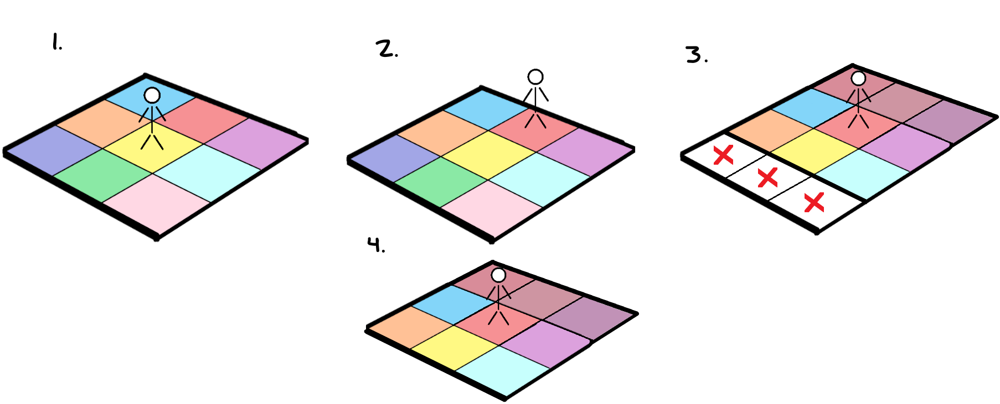

# Untiled

Developed with Unreal Engine 5

# Game Dev Project
##### The purpose of this project is to familiarize myself with UE5 internal C++ libraries and testing frameworks.
##### Technical Goalposts
  * ##### Understand UE5 Internal C++ Architecture.
  * ##### Properly utilize automatic functional testing framework.
  * ##### Property utilize built-in data structures.
  * ##### Create a workflow using both C++ and Blueprint classes.
##### Game Constaints
  * ##### Small scope, limited visual asset overhead
  * ##### Have at least 1 networked Component
  * ##### ~~3~~ 12-month goal
  
  #
  ## Game Idea : Infinite Wanderer
  * ### Components of roguelike
  * * Randomly generated enounters
  * * No/few longterm game state changes 
  
  * ### Camera
  * * Overhead third-person perspective camera
  * * Fog of war, limited/perspective
  
  * ### Environment - (WIP)
  * * Only persistent environment is player's current immediate surroundings
  * * Environment is represented as a (NxN) grid of chunks
  * * Discovered areas are randomly generated
  * * Areas previously visited will be destroyed and randomly regenerated if returned to
  * * State information of current tiles affects generation of newly generated chunks
  * 
   
   
  * ### Persistent Player Information
  * * Inventory
  * * Debuffs/Buffs
  * * Chunks Traveled (Progress)
 
